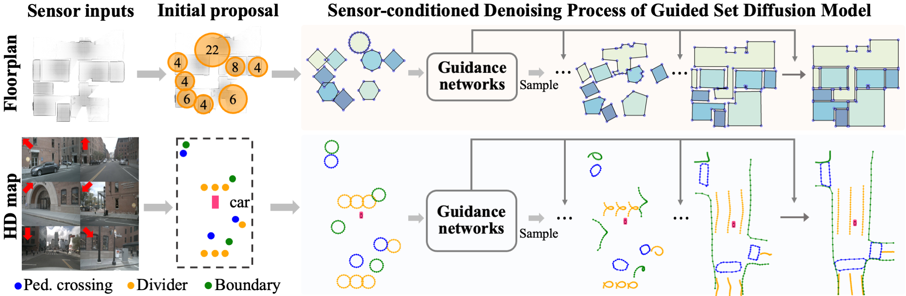
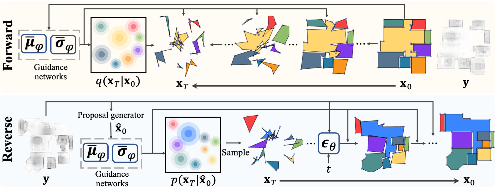
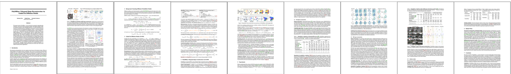

	 

>

<strong>Figure 1: PolyDiffuse for floorplan and HD map reconstruction:</strong> Starting from an initial proposal (e.g., from a human annotator or an existing method), the sensor-conditioned denoising process of our Guided Set Diffusion Model (GS-DM) generates shape reconstructions in a few sampling steps, initialized and directed by the guidance networks. The initial proposal above mimics simple human inputs that indicate rough locations and specify the number of vertices  for the polygonal shapes.

<iframe width="820" height="492" src="https://www.youtube.com/embed/pipJqdbH8XI" title="YouTube video player" frameborder="0" allow="accelerometer; autoplay; clipboard-write; encrypted-media; gyroscope; picture-in-picture; web-share" allowfullscreen></iframe>

	 

>

	<strong> Figure 2: </strong>Illustration of the forward and reverse processes of PolyDiffuse with floorplan data.

# Paper

	

>

	<a href="assets/paper.pdf"> Download PDF </a> &nbsp; &nbsp; <a href="https://arxiv.org/abs/2306.01461"> Arxiv </a> &nbsp; &nbsp; <a href="assets/supp.pdf"> Supplementary </a> &nbsp; &nbsp; 
	<!-- <a href="assets/poster.pdf"> Poster </a> -->

 

	<strong>@article{</strong>chen2023polydiffuse,
	 
	&nbsp;&nbsp;&nbsp;&nbsp; title={PolyDiffuse: Polygonal Shape Reconstruction via Guided Set Diffusion Models}, 
	  
	&nbsp;&nbsp;&nbsp;&nbsp; author={Chen, Jiacheng and Deng, Ruizhi and Furukawa, Yasutaka},
	  
	&nbsp;&nbsp;&nbsp;&nbsp; journal={arXiv preprint arXiv:2306.01461},
	  
	&nbsp;&nbsp;&nbsp;&nbsp; year={2023} <strong>}</strong>

# Code / Pre-trained Models

Our code and pre-trained models will be available on our [Github repo](https://github.com/woodfrog/poly-diffuse) soon.

# Acknowledgement

This research is partially supported by NSERC Discovery Grants with Accelerator Supplements and DND/NSERC Discovery Grant Supplement, NSERC Alliance Grants, and John R. Evans Leaders Fund (JELF). We thank the Digital Research Alliance of Canada and BC DRI Group for providing computational resources.
